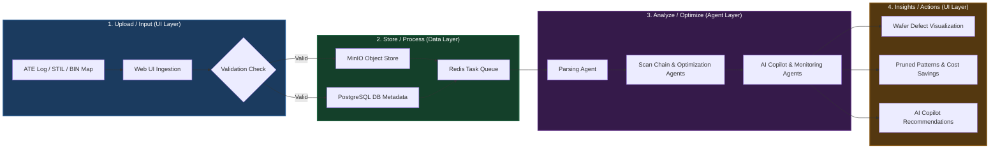
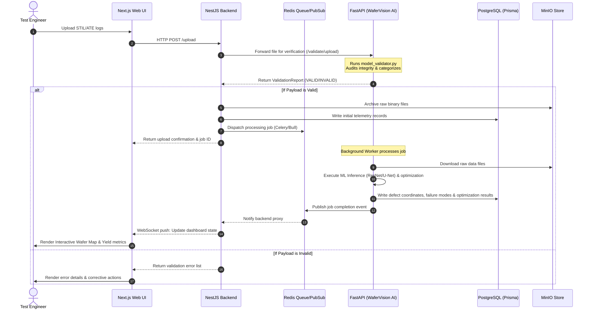

# System Architecture and Design Document
## Compty ATE Test Analysis & Yield Optimization Platform

---

## 1. Executive Summary

The **Compty ATE (Automated Test Equipment) Test Analysis & Yield Optimization Platform** is an enterprise-grade solution designed to ingest, process, analyze, and optimize semiconductor test data. By bridging the gap between hardware test engineers, Design-for-Test (DFT) patterns, and advanced AI methodologies, the platform significantly reduces test time, optimizes wafer yield, and accelerates defect root-cause analysis.

### Core Objectives:
*   **Yield Maximization**: Identify spatial wafer patterns and systematic faults using deep learning defect segmentation.
*   **Test Cost Reduction**: Implement early-stage pattern pruning and optimization algorithms to reduce test time on ATE machines.
*   **Automated Diagnostics**: Automate scan-chain analysis, MBIST/LBIST diagnosis, and parsing of complex standard test files (STIL, ATE logs).
*   **AI-Powered Copilot**: Democratize complex telemetry analysis via a natural language RAG (Retrieval-Augmented Generation) assistant.

---

## 2. High-Level Architecture Diagram

The system employs a decoupled, three-tier service topology optimized for high-throughput ingestion and heavy asynchronous computation:

```mermaid
graph TD
    %% UI Layer
    subgraph UI ["1. UI LAYER (React / Next.js 14)"]
        upload["File Upload (ATE Logs / STIL)"]
        charts["Interactive Charts (Trends & Yield)"]
        wafer["Wafer Map Viewer (Heatmaps / Overlays)"]
        chat["AI Copilot Chat (LLM Interface)"]
        export["Reports & Export (PDF / CSV)"]
    end

    %% Gateway
    nginx["Nginx Gateway (Reverse Proxy / Rate-Limiting)"]
    backend["NestJS API Gateway & Orchestrator"]

    %% Data Layer
    subgraph DATA ["2. DATA LAYER (Storage & Processing)"]
        postgres[("PostgreSQL Database (Prisma ORM)")]
        redis[("Redis Cache, Queue & Pub/Sub")]
        minio[("MinIO S3 Object Storage")]
    end

    %% AI Agent Layer
    subgraph AI ["3. AI AGENT LAYER (FastAPI / PyTorch / LLM / Agentic AI)"]
        parser["Parsing Agent (STIL/ATE Parser)"]
        scan["Scan Chain Agent (Connectivity & Faults)"]
        opt["Optimization Agent (Test Time/Cost Algorithms)"]
        copilot["AI Copilot Agent (LangChain + RAG)"]
        monitor["Monitoring Agent (Anomaly & Alerts)"]
    end

    %% Network flows
    UI -->|HTTPS / WSS / JSON| nginx
    nginx --> backend
    backend -->|Prisma client| postgres
    backend -->|Bull / Redis client| redis
    backend -->|S3 SDK| minio
    
    %% API / Service flows
    backend -->|HTTP / JSON API| parser
    backend -->|HTTP / JSON API| opt
    
    postgres <-->|Structured Relations| parser
    minio <-->|Raw Log / Weight Storage| AI
    redis <-->|Asynchronous Task Queue (Celery)| AI
    
    %% Connections within Data layer
    postgres <.->|Cache Keys| redis
    redis <.->|Temp Assets| minio
```

---

## 3. Detailed Layer Walkthrough

### 3.1 UI Layer (React / Next.js)

The frontend is a single-page application built on **Next.js 14** and **React**, deployed behind an Nginx reverse proxy. It provides clean, responsive interfaces built using HSL-tailored dark-mode aesthetics, premium typography (e.g., *Inter* or *Outfit*), and micro-animations for high engineering engagement.

#### A. Core Application Pages & Routes
*   **Main Dashboard Home (`/dashboard`)**:
    *   *KPI Widgets*: Renders real-time statistics including Overall Yield %, Total Test Cost, Cost per Wafer, Avg Test Time (ms), and Optimization ROI.
    *   *Controls*: Includes a Fab/Lot selector to filter the telemetry and interactive charts plotting test cost trends over time.
*   **File Upload Hub (`/dashboard/upload`)**:
    *   An interface that accepts drag-and-drop file inputs (ATE logs, STIL files, binary wafer bin-maps).
    *   Hooks directly into the validation microservice to present file verification reports before saving files to storage.
*   **Wafer Lot Viewer (`/dashboard/wafer-lot`)**:
    *   A visual grid displaying die-level coordinates, bin codes, and fail types.
    *   Supports dynamic toggling of overlays (Raw Bin Map, Defect Density Mask, and Grad-CAM Neural Attention Heatmaps).
*   **Pattern Analysis Portal (`/dashboard/pattern-analysis`)**:
    *   An interface displaying diagnostics logs with tabs for:
        *   *Overview*: Summaries of pattern failures and general coverage metrics.
        *   *Fail Analysis*: Coordinate fail locations and cycle-by-cycle fault severity profiles.
        *   *Scan Chains*: Shift cycles, shift length, and capture window details.
        *   *MBIST / LBIST / BIST*: Diagnostics for memory algorithms (MARCH, MATS) and logic block signature expectations.
        *   *Redundancy*: Row/column repair recommendations and available bit placements.
*   **Test Optimization Workspace (`/dashboard/test-optimization`)**:
    *   An interface for configuring constraints (max cost, test-time threshold, target yield).
    *   Displays optimization pruning run tables side-by-side with original vs. simulated optimized ROI statistics.
*   **ATE DFT Inspector (`/ate-dft`)**:
    *   Provides parsing stats, scan chain risk evaluations, and module-by-module risk rating metrics for ingested STIL/DFT test scripts.
*   **Alerts Dashboard (`/dashboard/alerts`)**:
    *   Displays active alerts, notifications, and tester anomaly reports.
*   **Equipment Dashboard (`/dashboard/equipment`)**:
    *   Allows configuration of tester billing rates (USD/sec) and fab tester details.

#### B. Key Interactive UI Component Modules
*   **[ModelValidationPanel](file:///d:/officw%20work%20-1/ai-1/frontend/src/components/ModelValidationPanel.tsx)**: Displays incoming file metadata, column null statistics, and recommended backend pipelines.
*   **[WaferHeatmap](file:///d:/officw%20work%20-1/ai-1/frontend/src/components/dashboard/WaferHeatmap.tsx)**: HTML5 Canvas-based coordinate plotting tool with interactive mouse-hover tooltips for die-level details.
*   **[PatternCostTable](file:///d:/officw%20work%20-1/ai-1/frontend/src/components/dashboard/PatternCostTable.tsx)**: Sortable lists of test patterns, showing test times, costs, kill ratios, and recommended optimization actions (Prune vs Keep).
*   **[OptimizationEngine](file:///d:/officw%20work%20-1/ai-1/frontend/src/components/dashboard/OptimizationEngine.tsx)** & **[OptimizationResults](file:///d:/officw%20work%20-1/ai-1/frontend/src/components/dashboard/OptimizationResults.tsx)**: Interactive slider and chart modules for running test configuration pruning tests.
*   **[ChainAnalysisPanel](file:///d:/officw%20work%20-1/ai-1/frontend/src/components/pattern-analysis/ChainAnalysisPanel.tsx)**: Specialized scan chain debugging view displaying pass/fail cycles.
*   **[FlipFlopModal](file:///d:/officw%20work%20-1/ai-1/frontend/src/components/pattern-analysis/FlipFlopModal.tsx)**: Modal overlay displaying register logic structures when a particular scan flip-flop failure is clicked.
*   **[MbistTab](file:///d:/officw%20work%20-1/ai-1/frontend/src/components/pattern-analysis/MbistTab.tsx)** & **[LbistTab](file:///d:/officw%20work%20-1/ai-1/frontend/src/components/pattern-analysis/LbistTab.tsx)**: Memory array tables showing MARCH patterns and signature signature mismatches.


---

### 3.2 Data Layer (Storage & Processing)

The storage architecture is split based on data structure requirements:

#### A. PostgreSQL (Relational & Analytical Engine)
Utilized to model system entities, test telemetry, historical yields, and metadata. DB migrations are managed through **Prisma**. Below is a summary of the core relational tables matching the schema:

| Table / Entity | Description | Critical Fields |
| :--- | :--- | :--- |
| **Fab** | Repositories for fabs | `id`, `name`, `location`, `createdAt` |
| **Tester** | Represents physical ATE machinery and billing | `id`, `name`, `equipmentRate` (USD/sec), `fabId` |
| **Lot** | Grouping of tested wafers | `id`, `lotId` (unique), `testerId`, `status` (IN_TEST, COMPLETED) |
| **Wafer** | A physical semiconductor wafer under test | `id`, `waferId`, `lotId` |
| **Die** | Individual die telemetry coordinate records | `id`, `waferId`, `x`, `y`, `bin`, `failType` |
| **Pattern** | Representing test patterns applied to the dies | `id`, `patternId` (unique), `patternType` (SCAN, BIST, ATPG, etc.) |
| **TestResult** | Transactional results of pattern execution per die | `id`, `dieId`, `patternId`, `testTimeMs`, `passed`, `costUsd` |
| **DashboardSnapshot**| Pre-calculated historical aggregates for performance optimization | `id`, `totalTestCost`, `costPerWafer`, `yieldOverall`, `roiImprovement` |
| **OptimizationJob** | Asynchronous run configuration and outcome data | `id`, `jobId`, `lotId`, `constraints` (JSON), `status` (QUEUED, COMPLETE), `results` |
| **PatternAnalysis** | Diagnostic metrics computed for a test lot | `id`, `lotId`, `coveragePct`, `executionTimeMs`, `faultsCovered` |
| **FailSite** | Physical locations (registers/gates) of specific fault signals | `id`, `dieX`, `dieY`, `severity` (1-5), `cycleCount` |
| **ScanChainResult** | Physical scan chain failure states | `id`, `chainId`, `chainLength`, `cellsFailed`, `passRate` |
| **WaferImage** | Images generated for AI defect analysis | `id`, `waferId`, `imageType` (RAW_BIN, DEFECT_MASK, GRADCAM_OVERLAY), `storageKey` |
| **ValidationReport** | Output of incoming ATE upload audits | `id`, `validationId`, `status` (VALID, INVALID), `reportJson` |

#### B. Redis (Caching & Job Queuing)
Acts as the latency-reduction store and background orchestration mechanism:
*   **Cache & Queue**: Stores session credentials, temporary API responses, and database connection state variables.
*   **Job Queue**: Backs the NestJS **Bull queue** (and Python **Celery** tasks) for dispatching long-running parse and image segmentation jobs.
*   **Real-time Pub/Sub**: Relays server-side events (such as progress bars on parsing or real-time wafer scanning status) back to client websockets.

#### C. MinIO (Unstructured Object Storage)
An S3-compatible local object store used to safeguard high-volume binary blobs:
*   **Raw ATE Logs & STIL Files**: Archival of original unparsed engineering test reports.
*   **Wafer Maps / Images**: Raw and generated PNGs (e.g., Grad-CAM heatmaps, segmentation masks).
*   **ML Model Weights**: Repository of active ResNet50 classification and U-Net segmentation weights used by `wafer-ai`.
*   **Reports & Exports**: Rendered PDF report bundles and bulk CSV outputs for user retrieval.

---

### 3.3 AI Agent Layer (AI & Intelligence)

Operating as an independent Python FastAPI microservice, the AI Agent layer executes deep learning inference, parsing routines, and LLM agent chains:

1.  **Parsing Agent**
    *   *ATE Log Parser & STIL Parser*: Automatically scans raw text data, identifying keywords, parsing pin headers, signal names, scan chain declarations, and patterns.
    *   *Pattern Mapper*: Maps failed test vectors back to specific physical coordinate groups and registers.
2.  **Scan Chain Agent**
    *   *Scan Chain Analysis*: Tracks shift cycles, capture windows, and scan pattern sequences.
    *   *Fault Detection*: Classifies faults into standardized semiconductor structural modes (Stuck-At, Transition, Cell-Aware, Bridge, and Path Delay).
3.  **Optimization Agent**
    *   *Constraint Pruning (run_constraint_pruning)*: Iterative optimization algorithms that evaluate pattern execution cost vs. coverage. If a pattern has low coverage and high test cost, it is marked for pruning under specific cost-per-wafer limits.
    *   *ROI Improvement*: Simulates and predicts test time reductions and dollar savings based on tester rates.
4.  **AI Copilot Agent**
    *   *LangChain Orchestration*: Runs active chains that interface with local/cloud LLMs.
    *   *Retrieval-Augmented Generation (RAG)*: Feeds parsed documentation, STIL specs, and historical lot results into a vector layout, allowing developers to query failure causes in natural language.
5.  **Monitoring Agent**
    *   *Anomaly Detection*: Continuously checks tester throughput and fail rates across lots to detect tester anomalies (e.g., contact failure vs. actual die defect).
    *   *Alerting Engine*: Triggers Slack/Email webhooks on catastrophic yield crashes.

---

## 4. End-to-End System Execution Flow

The system processes incoming files in a sequential pipeline across layers, moving from raw uploads to actionable yield insights.

### 4.1 Data Pipeline Flowchart (Data Lifecycle)

The diagram below maps how telemetry data flows and transforms through the system layers:



### 4.2 End-to-End Execution Sequence Diagram

The sequence diagram below shows the detailed real-time interaction and communications between individual microservices and database engines:




### Flow Step Explanation:
1.  **Ingestion & Validation**: An engineer uploads ATE test output or wafer maps. The file hits Nginx, is routed to the NestJS orchestrator, and is forwarded to FastAPI's `/validate/upload` endpoint.
2.  **Structural Audit**: The validation router (`model_validator.py`) inspects file headers, sizes, and layout. It flags anomalies (such as high null counts or invalid coordinates) and suggests a target prediction pipeline (e.g., `/predict/wafer-classification`).
3.  **Storage Isolation**:
    *   Raw logs are cataloged in PostgreSQL (`ValidationReport` entity) and uploaded to the MinIO raw repository.
    *   If validation succeeds, a background optimization or analytics job is scheduled in Redis.
4.  **Agent Logic Processing**:
    *   *Parsing / Scan Chain Agents* extract structural test registers and coverage logs.
    *   *Yield / Wafer Vision Agents* run semantic segmentation (U-Net) on the coordinates to trace visual failure signatures (such as ring, scratch, or donut defects).
5.  **Telemetry Insertion**: Processed coordinate tables are inserted into PostgreSQL as `Die` and `TestResult` entities. Generative heatmaps and Grad-CAM overlays are stored back in MinIO as PNG objects, with a record inserted in the `WaferImage` database table.
6.  **Interactive Rendering**: The user is notified via WebSockets (backed by Redis Pub/Sub). The dashboard UI refreshes to show defect categorization, optimized pattern recommendations (reducing test time), and root-cause analysis descriptions.

---

## 5. Security & Deployment Profile

*   **Gateway Isolation**: The frontend and backend reside inside a private Docker bridge network. Nginx serves as the sole external-facing gateway on Port 80/443, executing path-based routing (`/` to Next.js UI, `/api` to NestJS Backend).
*   **Database Connection Pooling**: Prisma connections to PostgreSQL are optimized (`connection_limit=10&pool_timeout=30`) to protect the database against connection starvation during high-concurrency batch uploads.
*   **Container Orchestration**: Core components are isolated as separate microservice instances (`postgres`, `redis`, `wafer-ai`, `backend`, `frontend`, `minio`, `nginx`), managed via Docker Compose and configured through standard environment variable overrides (`.env`).
