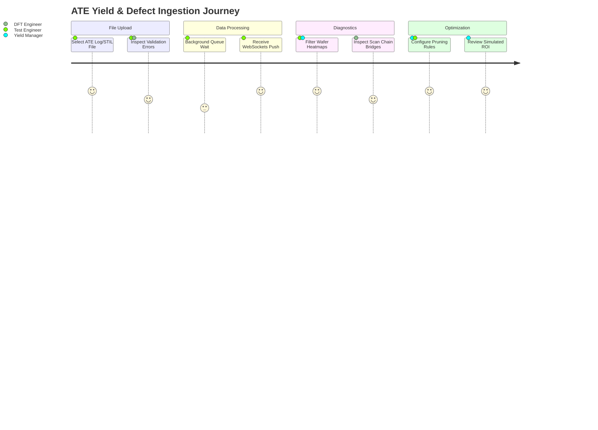

# UI Product Requirements Document (PRD)
## Compty ATE Wafer AI & Yield Optimization Platform - UI Layer

---

## 1. Document Control & Scope

### 1.1 Introduction
This document defines the functional, non-functional, and visual requirements for the user interface layer of the **Compty ATE Test Analysis & Yield Optimization Platform**. The frontend is built on **React & Next.js 14** using Next.js App Router topology.

### 1.2 Target Audience
*   **ATE Test Engineers**: Responsible for uploading log telemetry, validating test runs on tester hardware, and monitoring active yields.
*   **DFT (Design-For-Test) Engineers**: Responsible for debugging scan chain failures, examining MBIST/LBIST reports, and verifying fault coverage.
*   **Yield & Operations Managers**: Responsible for assessing product profitability, review of test cost optimization, and exporting dashboard summaries.

---

## 2. User Personas & Core Journeys

### 2.1 Persona 1: ATE Test Engineer (The Ingest & Monitor User)
*   **Need**: Needs a friction-free gateway to drag-and-drop huge text files (ATE logs, STIL maps), verify that files are structurally complete, and look at live wafer yield maps to spot defect signatures (scratches, rings).
*   **Journey**:
    1. Drag-and-drop a batch of ATE logs into the upload hub.
    2. Check the validation pane for warnings or syntax errors.
    3. Click to run the AI classification pipeline.
    4. View the resulting interactive 2D wafer map to identify defective spatial coordinate bins.

### 2.2 Persona 2: DFT Diagnostic Engineer (The Debug User)
*   **Need**: Needs to trace test pattern failures to physical registers and logic cells, identify bridged scan chains, inspect BIST failures, and query the copilot agent for similar historical signatures.
*   **Journey**:
    1. Open the Pattern Analysis panel for a specific failed lot.
    2. Navigate to the **Scan Chain** tab to see which chain indices failed.
    3. Click on a failed cycle flip-flop to open the structural details overlay.
    4. Ask the AI Copilot: *"What was the root cause of cell failure in Lot-2024-001?"*

### 2.3 Persona 3: Yield Manager (The Business & ROI User)
*   **Need**: Needs to optimize test programs to cut production costs, configure yield targets, and export reports for executive review.
*   **Journey**:
    1. Navigate to the Test Optimization panel.
    2. Slide constraints to set a yield target of 92% and max test time to 400ms.
    3. View the cost reduction simulation comparing original costs vs. proposed pruned pattern configurations.
    4. Export the simulated metrics as a clean PDF summary.

---

## 3. Functional Requirements by Component

### 3.0 Executive Dashboard Overview & KPI Redesign (`/dashboard`)
*   **Req-0.1 (KPI Summary deck - Image 2 Redesign)**: Display six circular-icon styled cards representing key semiconductor execution statistics:
    *   *Total Test Cost*: Purple accent, Dollar Sign icon.
    *   *Cost per Wafer*: Blue accent, Wafer/File icon.
    *   *Cost per Die*: Green accent, Die grid icon.
    *   *Test Time (Avg)*: Orange/Amber accent, Clock icon.
    *   *Yield (Overall)*: Green accent, Check icon.
    *   *ROI Improvement*: Pink accent, Rocket icon.
*   **Req-0.2 (Sparkline Trend Waves)**: Every KPI metric card must render a dynamic SVG sparkline curve at the bottom, styled with the card's accent color to indicate 7-day trend history.
*   **Req-0.3 (Trend Delta Annotations)**: Display trend change text (e.g. `↓ 12.6% vs last week` or `↑ 1.8% vs last week`) colored green for positive gains and red for negative shifts.
*   **Req-0.4 (Interactive Wafer Yield Map)**: Render the custom 2D wafer layout displaying passing and failing dies with interactive zoom and tooltips.
*   **Req-0.5 (Pattern Cost Distribution Table)**: Provide a dynamic paginated grid showing pattern test coverage, execution times, and recommendation actions (`KEEP` / `OPTIMIZE` / `ELIMINATE`).
*   **Req-0.6 (AI Co-Optimization sliders)**: Standardize slider controls to constrain maximum cost, yield target floor, and test sweep limits.
*   **Req-0.7 (Simulated ROI charts)**: Display a comparative bar chart and metrics tracking optimized annual savings and yield delta projections.

### 3.1 File Ingest & Validation Dashboard (`/dashboard/upload`)
*   **Req-1.1 (Upload Pane)**: Provide a drag-and-drop area supporting multiple file types (`.csv`, `.xlsx`, `.json`, `.jsonl`, `.png`, `.jpg`, `.bin`, `.stil`, `.log`, `.rpt`). Maximum file size limit: **500MB**.
*   **Req-1.2 (Real-Time Quality Audit)**: Render the `ModelValidationPanel` immediately upon file drop. Display:
    *   Ingested file categories (Structured vs Unstructured).
    *   Validation Status badge: `VALID` (green), `WARNING` (orange), or `INVALID` (red).
    *   Error list containing line index references, code severity, and detailed audit explanations.
*   **Req-1.3 (Recommended Pipeline Actions)**: The UI must display a recommended prediction pipeline route button (e.g., "Run Wafer Classification") based on detected domains.

### 3.2 Wafer Map Viewer (`/dashboard/wafer-lot`)
*   **Req-2.1 (Interactive Coordinate Map)**: Render the wafer maps inside an HTML5 Canvas grid using dynamic coordinate scaling (support up to **100,000 dies** per wafer).
*   **Req-2.2 (Die Hover telemetry)**: Hovering over a die coordinate must draw a tooltip display detailing coordinate values $(X, Y)$, bin ID, test time, cost, pass/fail status, and fault category.
*   **Req-2.3 (Overlay Controls)**: Provide radio selectors to toggle active visual layer overlays:
    *   *Raw Bin Map*: Color-coded categories mapping to die bin numbers.
    *   *Density Map*: Heatmap representing spatial defect concentrations.
    *   *Grad-CAM Overlay*: Transparent overlay showing Neural Network attention values for spatial classification.

### 3.3 Pattern Analysis & Diagnostics (`/dashboard/pattern-analysis`)
*   **Req-3.1 (Overview Stats)**: Render a grid of KPI summary blocks tracking Total Patterns, Coverage %, Faults Covered, and execution times.
*   **Req-3.2 (Scan Chain Analyzer)**: Render the `ChainAnalysisPanel` listing chain IDs, length, shift cycles, pass rates, and bridged cell counts.
*   **Req-3.3 (Register Details)**: Clicking on a failed cell inside the scan list must trigger the `FlipFlopModal`, rendering cell register schemas, signal logic levels, and expected vs. actual values.
*   **Req-3.4 (MBIST/LBIST Diagnostics)**: Render cell mapping diagnostics indicating failures grouped by March algorithms (e.g., MARCH C-, MATS++). Show memory word/bit addresses in dynamic tabular formats.

### 3.4 Test Pruning & Optimization Workspace (`/dashboard/test-optimization`)
*   **Req-4.1 (Constraint Settings)**: Provide slider inputs for three key variables:
    *   *Max Cost per Wafer* (in USD).
    *   *Yield Target %* (e.g., 0% to 100%).
    *   *Max Test Time* (in milliseconds).
*   **Req-4.2 (Pruning Recommendations Table)**: Display an interactive grid listing applied test patterns, their individual execution time, cost, kill ratio, and simulated action recommendation (`PRUNE` or `KEEP`).
*   **Req-4.3 (ROI Comparison charts)**: Render double-bar charts comparing Before vs. After optimization costs and run-times.

### 3.5 AI Copilot Drawer
*   **Req-5.1 (Natural Language Ingestion)**: Provide a persistable sidebar drawer with chat input for query inputs.
*   **Req-5.2 (RAG Citations)**: Responses must render inline citation links. Hovering over a citation link must show metadata referencing target raw lines or database rows.

---

## 4. Non-Functional & Quality Requirements

### 4.1 Performance & Responsiveness
*   **NFR-1.1 (Grid Rendering Speed)**: Wafer canvas components must load and render coordinate grids containing up to 100,000 coordinate dies in **less than 500ms**. Web workers must be used to calculate matrix translations so the UI main thread does not lock up.
*   **NFR-1.2 (Asynchronous Status Ingestion)**: State updates for background file-parsing queues must be pushed through WebSocket connections (via Socket.io). The UI must animate loading indicators with detailed step metrics (e.g., "Parsed 40% of patterns").
*   **NFR-1.3 (Asset Caching)**: High-resolution images (Grad-CAM files, overlays) must use client-side IndexedDB caching or service workers to prevent repeated S3 downloads.

### 4.2 Visual System & Theme Specifications
*   **Aesthetics**: Sleek dark-mode system prioritizing clean contrast ratios.
*   **Typography**: Outfits or Inter headers. Monospaced families (e.g., Fira Code) for log dumps and coordinate values.
*   **Motion**: Transition times for sliders, drawers, and modal popups set to `150ms ease-out` or `200ms cubic-bezier`.

### 4.3 Accessibility (A11y) & Automated Testing
*   **A11y-1.1 (Screen Readers & Labels)**: Interactive elements, filters, and canvas triggers must contain standard ARIA-label declarations.
*   **Test-1.1 (Unique Test IDs)**: All interactive buttons, upload inputs, selector cards, and tab selectors must carry unique HTML attributes `data-testid` (e.g., `data-testid="lot-selector-dropdown"`) to allow automated Playwright testing.

---

## 5. UI-to-Database Traceability Matrix

| UI Component/Page | Prisma Model Mapping | Data Operations |
| :--- | :--- | :--- |
| **Ingestion Upload Page** | `ValidationReport`, `AteDftFile` | Writes raw blobs, logs audit issue counts, registers parse pipelines |
| **Wafer Lot Map Viewer** | `Wafer`, `Die`, `WaferImage`, `AiWafer` | Reads die coordinates, binds coordinates to bin values, fetches S3 overlays |
| **Pattern Diagnostics Tab** | `PatternAnalysis`, `FailSite`, `ScanChainResult`, `CoverageMetric` | Queries coverage gaps, cycle failure rates, and severe fail register locations |
| **BIST Diagnostics Tab** | `MbistResult`, `LbistResult`, `BistResult` | Queries memory address errors, check march algorithms, maps expected signatures |
| **Optimization Workspace** | `OptimizationJob`, `Pattern`, `TestResult` | Runs optimization pruning tasks, updates simulated configurations, tracks ROI snapshots |
